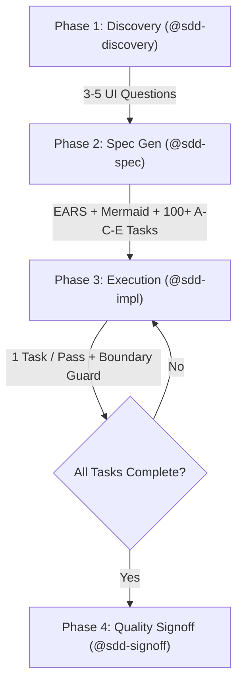

# `ag-sdd` — Anti-Gravity Spec-Driven Development

[](https://www.npmjs.com/package/ag-sdd)
[](https://opensource.org/licenses/MIT)
[](https://nodejs.org)
[](https://antigravity.google)
[](#ears-syntax-reference)

> **The production-grade Spec-Driven Development harness and skill suite built specifically for Google Antigravity (AGY).**  
> Eliminates the two primary failure modes of AI coding agents: **Thin Thinking** (shallow task breakdown) and **Boundary Violations** (modifying unlisted files).

---

## 🌟 Key Features

- **🛡️ Deterministic System Boundary Guard (`hooks/boundary-guard.mjs`)**: System-level `PreToolUse` hook intercepts file modification tools (`write_to_file`, `replace_file_content`, `multi_replace_file_content`) and blocks unlisted file edits.
- **💬 6-Category Deep Discovery Protocol (`@sdd-discovery`)**: Mandates a 6-category architectural interview (Scope, Data Models, Integrations, Fault Tolerance, SLAs, Empirical Testability) asking 3 to 5 sharp, interactive questions via native `ask_question` UI modals.
- **📐 EARS Syntax Requirements (`01_requirements.md`)**: Enforces Easy Approach to Requirements Syntax (`WHEN`, `WHILE`, `WHERE`, `IF...THEN`, `THE SYSTEM SHALL`) for testable requirements.
- **⚡ Uncapped Granularity Task Engine (50–100+ Tasks)**: Vertically sliced wave structures (`P0 Foundation` → `P1 Data Models` → `P2 Repositories` → `P3 Business Logic` → `P4 APIs` → `P5 Testing`) with zero thin thinking.
- **🤖 Specialized SDD Subagents (`.agents/agents/`)**: Includes `sdd-architect`, `sdd-executor`, and `sdd-reviewer` subagents for autonomous delegation.
- **🎛️ Interactive Mention Commands (`.agent/workflows/`)**: Native `@sdd-discovery`, `@sdd-spec`, `@sdd-impl`, `@sdd-signoff`, and `@sdd-status` workflows.
- **📊 Programmatic CLI State Engine (`bin/cli.mjs`)**: CLI commands for `start`, `complete`, `active`, `graph` (Mermaid DAG generator), `linter`, `reset`, and `status`.

---

## 🚀 Quick Start

### Option 1: Universal Skills CLI *(Recommended)*
In any repository or project:
```bash
npx skills add stormlive-ai/ag-sdd
```

### Option 2: Project Initialization via `npx`
Initialize `ag-sdd` inside your workspace:
```bash
npx ag-sdd init
```

### Option 3: Global Machine Installation
Equip all projects on your machine with `@ag-sdd`:
```bash
npx ag-sdd init --global
```

---

## 🏛️ SDD Workflow Lifecycle



---

## 🎛️ Chat Mention Commands

When operating inside Antigravity chat, use `@` mentions to trigger workflows:

| Command | Purpose |
|---|---|
| `@sdd-discovery <description>` | Launches Phase 1 Discovery & 3-5 UI clarification questions |
| `@sdd-spec <feature-name>` | Generates `00_research.md`, `01_requirements.md`, `02_design.md`, `03_tasks.md` & runs linter |
| `@sdd-impl <feature-name>` | Executes next task within `_Boundary:_` and runs verification |
| `@sdd-signoff <feature-name>` | Executes test suite & populates `04_signoff.md` report |
| `@sdd-status` | Renders task matrix, active tasks, and executable next tasks |

---

## 💻 CLI Commands Reference

`ag-sdd` comes with a zero-dependency CLI engine:

```bash
ag-sdd init                             # Scaffold rules, skills, subagents, workflows, hooks
ag-sdd init --global                    # Install @ag-sdd globally into ~/.gemini/
ag-sdd new <feature-name>               # Create new feature spec from templates
ag-sdd status                           # View task progress matrix across all features
ag-sdd next                             # Display next executable task with dependencies satisfied
ag-sdd start <feature> <task>           # Mark a task in-progress [/]
ag-sdd complete <feature> <task> -n "…" # Mark a task complete [x] and append implementation note
ag-sdd active                           # Display currently active task & boundary
ag-sdd reset <feature> <task>          # Reset a task back to pending [ ]
ag-sdd graph <feature>                  # Output visual Mermaid DAG of task dependencies
ag-sdd linter <feature>                 # Audit spec quality against EARS syntax & field completeness
ag-sdd verify                           # Structural verification check
ag-sdd notes                            # View accumulated implementation notes
```

---

## 📐 EARS Syntax Reference

Requirement statements in `01_requirements.md` follow **Easy Approach to Requirements Syntax**:

- **Ubiquitous**: The `<system>` shall `<response>`.
- **Event-Driven**: When `<trigger>`, the `<system>` shall `<response>`.
- **State-Driven**: While `<state>`, the `<system>` shall `<response>`.
- **Unwanted Behavior**: If `<condition>`, then the `<system>` shall `<response>`.
- **Optional Feature**: Where `<feature>`, the `<system>` shall `<response>`.

---

## 🤝 Contributing

Contributions are welcome! Please read [CONTRIBUTING.md](./CONTRIBUTING.md) before submitting pull requests.

---

## 📄 License

[MIT License](./LICENSE) © 2026 Anti-Gravity SDD Contributors
