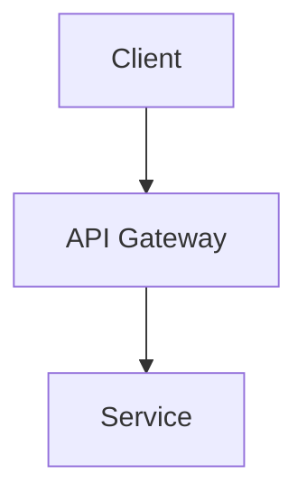
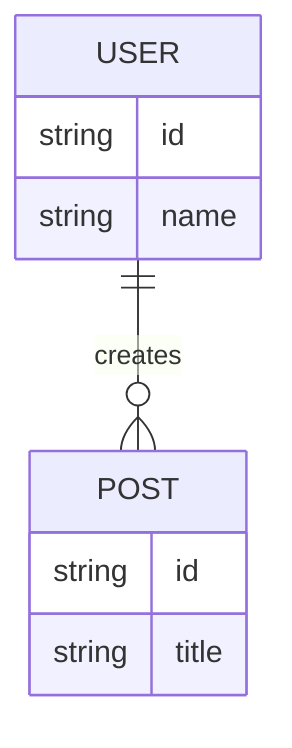
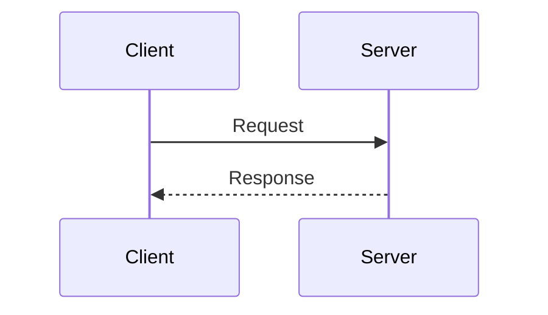

# Design: {{FEATURE_NAME}}

<!--
  Instructions for the Agent:
  Use this template to outline the technical design of the feature.
  Provide sufficient detail to guide implementation without being overly prescriptive about implementation details unless necessary.
-->

## Architecture Overview
<!-- Provide a high-level description of the system architecture. Replace the placeholder with a real Mermaid diagram. -->
{{ARCHITECTURE_DESCRIPTION}}



## Component Breakdown
<!-- List the logical components involved in this feature. -->
| Component | Responsibility | Key Interfaces | Owner Module |
|---|---|---|---|
| {{COMPONENT_NAME}} | {{RESPONSIBILITY}} | {{INTERFACES}} | {{MODULE}} |

## Data Model
<!-- Define the entities and relationships. Replace the placeholder with a Mermaid ERD. -->
{{DATA_MODEL_DESCRIPTION}}



## API Contracts
<!-- Define endpoint signatures, function signatures, and request/response schemas. -->
### `{{ENDPOINT_OR_FUNCTION}}`
- **Request:**
  ```json
  {
    "{{KEY}}": "{{VALUE}}"
  }
  ```
- **Response:**
  ```json
  {
    "{{KEY}}": "{{VALUE}}"
  }
  ```

## Sequence Diagrams
<!-- Illustrate key flows and interactions between components. -->


## File Structure Plan
<!-- Outline the exact files to be created or modified, mapped to their respective components. -->
```text
{{ROOT_DIR}}/
├── {{PATH_TO_FILE_1}}  # Component: {{COMPONENT_1}}
└── {{PATH_TO_FILE_2}}  # Component: {{COMPONENT_2}}
```

## Security Considerations
<!-- Address authentication, authorization, input validation, secrets management, etc. -->
- {{SECURITY_CONSIDERATION}}

## Error Handling Strategy
<!-- Describe the error taxonomy and recovery patterns. -->
- {{ERROR_HANDLING_STRATEGY}}

## Dependencies
<!-- List new packages or modules required, along with justification. -->
- `{{DEPENDENCY_NAME}}`: {{JUSTIFICATION}}

## Alternatives Considered
<!-- Document alternative designs that were evaluated and why they were rejected in favor of this one. -->
- **{{ALTERNATIVE_NAME}}**: {{REASON_REJECTED}}
